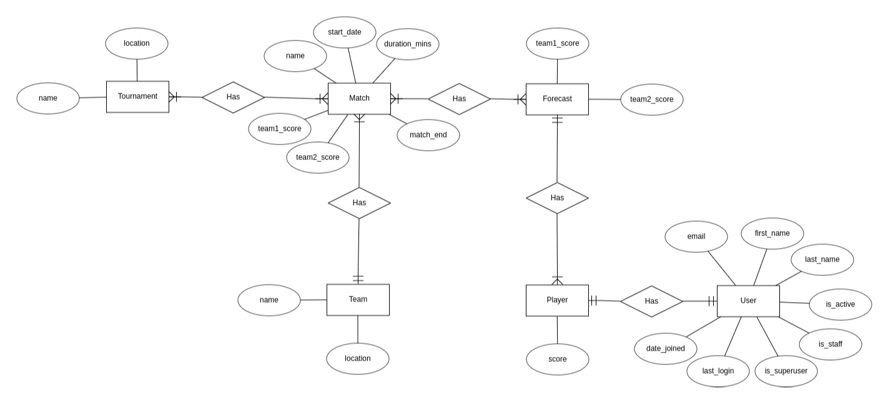

# Prode REST API

An API project using [Django REST Framework](https://www.django-rest-framework.org/) about a prode/sports lottery that lets users compete in a friendly app with sports results and keep track of the scores, main player, pichichi and many more.

Still in construction.

## Why Django?

Django is a Python web development framework. It is between the most used/recognized frameworks along side Flask and FastAPI.
Constant developer errors feedback, simplicity, pre solved problems, integrated admin site, user system, automated testing, extensive documentation, 
REST Framework also allow Django to become a backend server capable of connecting with any frontend framework and language as it is the trend in the industry nowadays. JavaScript dominates the frontend more popular frameworks like Vue, Angular, React.

## Features

Sports forecast application
Score rank between player
Set up tournament and teams, create matchs and play with friends
Custom users app

## What's missing

...

## FAQs

Q: Can i use the project for personal/commercial use?

A: Yes.

## Quick start

How to section with the steps to set up the project in your system.

<details><summary><b>Setting the project up</b></summary>

### Install dependencies

To run this project you need to install `Docker` and `Docker Compose`.

In [this article](https://support.netfoundry.io/hc/en-us/articles/360057865692-Installing-Docker-and-docker-compose-for-Ubuntu-20-04) are the details to install Docker and Docker Compose on a Linux machine. In case you want to install the tools on another platform or have any problems, you can read the official documentation of [Docker](https://docs.docker.com/get-docker/) and also that of [Docker Compose](https://docs.docker.com/compose/install/).

Continue with downloading the code when you have the dependencies installed and working.

### Download the code

To download the code, the best thing to do is to `fork` this project to your personal account by clicking on [this link](https://github.com/LaColorada/prode_rest/fork). Once you have the fork to your account, download it from the terminal with this command (remember to put your username in the link):

```
git clone https://github.com/USER/prode_rest.git
```

> In case you don't have a Github account, or you don't want to fork, you can directly clone this repo with the command `git clone https://github.com/LaColorada/prode_rest.git`.

### Linter and formatter

This project uses Pylint and Black.
Black is(quote of project readme):

Black is the uncompromising Python code formatter. By using it, you agree to cede control over minutiae of hand-formatting. In return, Black gives you speed, determinism, and freedom from pycodestyle nagging about formatting. You will save time and mental energy for more important matters. 

### Initial project configuration

To run the application, you first need to download the database image with the `docker compose pull pgdb` command. Next, you need to compile the REST API service with the `docker compose build rest-api` command (it may take a few minutes).

When the above processes finish, start the database service with the command `docker compose up -d pgdb` from the root of the project. With the database running, it is necessary to create the tables that the application needs to work with the command `docker compose run rest-api python3 manage.py migrate`.

It is possible to load sample data to test the API as quickly as possible. The sample data is in the `.example_data` directory. The command needed for load fixture is as follows (in the example, the `example_data.json` fixtures will be loaded):

```
docker-compose run drf-api python3 manage.py loaddata .fixtures/example_data.json
```

### Run the application

With the initial configurations done, now it's time to run the API service with the command `docker compose up rest-api` (if you want to run the service in background, you can add the -d flag during execution). When the service starts, you can access the `Browsable API` from the browser by entering the [api root endpoint](http://localhost:8000/).

If you are able to access the `Browsable API`, it means that the application is running correctly.

</details>

## Documentation

In this section you will find the information to understand and configure the project.

<details><summary><b>See the details</b></summary>

### Main features

Below you can see the main features of the project:

* REST API fully explorable through the Django REST "Browsable API" and hyperlinks
* User registration, login, logout, password recovery, account activation
* Application administration panel
* Customized Browsable API for each endpoint
* Extensive usage documentation

The feature related to each application is included in the [Applications](#applications) section.

### Django Configuration

In the file `./core/settings.py` you will find the general configuration of the Django project. Within this file, all kinds of Django configurations can be made, in which the following stand out:

* Selection and configuration of the database engine.
* Applications installed within the project.
* Time zone setting.
* Project debug configuration.
* Django REST Framework specific configuration.
* Template configuration.
* Directory configuration for static files.
* User model selection.
* User Authentication & Authorization.

For more information on all the possible configurations, you can access the official documentation at [this link](https://docs.djangoproject.com/en/3.2/topics/settings/).

### Browsable API

This application - by using Django REST Framework - has a functionality that makes the REST API browsable in HTML format. This feature is really an excellent functionality, as it enables you to explore, navigate, and discover the API without having to open any dedicated programs (such as Postman or other clients).

From the browsable API you can access to Home Endpoint, and navigate over the user registration, login, logout, password recovery and email confirmation flows. 

The usage flow related of each application is included in its [Applications](#applications) section.

### How to use the service API

The starting point of using the API is accessing its [root](http://localhost:8000) via a client or a browser. From there you can see some useful endpoints related to user registration, login, logout and probably your custom applications endpoints.

**User Registration, Verification & Login**

1. Access to the [root endpoint](http://localhost:8000) to explore the service endpoints.
2. Access to the [user registration](http://localhost:8000/auth/registration) endpoint to create an user account. Fill fields with your email and insert twice an strong password.
3. Verify your account via email accessing to the link shown in the console after registration.
4. Access to the email verification and insert your email and password. An access tokens will be returned. You can save it for your mobile/web/desktop app. If you are using the Browsable API the user will be logged in.
5. Go to [root endpoint](http://localhost:8000) and explore applications endpoints.

**User Logout**

To logout just follow the [user logout](http://localhost:8000/auth/logout) endpoint and send a POST request.

**User Password Reset**

If you have forgotten your password, you can recover it accessing to the [password change endpoint](http://localhost:8000/auth/password/change/). Follow the next steps:

1. Insert your email and send it via POST.
2. Check your email or the "django console email" to access to the link to password change.
3. Insert the needed fields. `UID` is the anteultimate URL slug, and the `Token` field is the last URL slug (probaby the token slug includes a "-" char). After required fields just type your new password twice and POST it.

**Applications flows**

The specific app endpoints are described in each section of [Applications](#applications).

### Using the admin site

The API service has an integrated administration panel that allows you to perform CRUD operations on each of registered applications models (tables). In this image you can see how the administration panel looks.


To use the admin site you must create a superuser before. Execute the command `docker compose run rest-api python3 manage.py createsuperuser`, enter your email and your password twice and then go to [admin endpoint](http://localhost:8000/admin) to login with your credentials.

There are many sections included in the admin, like `Accounts`, `Tokens`, `Sites`, `Social Accounts` and `Users`. This applications are included in the base project to provide user auth flows.

Apart of the base sections, there are the custom applications, explained in the [Applications](#applications) section.

### Environment Variables

Some environment variables used by the database service, as well as the API service, are defined in the `env` file. Necessary variables can be added/removed. In case you accidentally delete the values or the env file, below you can find some values that work correctly with the application.

```
DJANGO_SECRET_KEY="django-insecure--oa7y^7se7-$1pg5kx21dyg-_$j@=h=s18mukwd91jx#gx@a*!"
DJANGO_DEBUG=True
DATABASE_NAME=postgres
DATABASE_USER=postgres
DATABASE_PASS=postgres
DATABASE_HOST=db
DATABASE_PORT=5432
```

It is **HIGHLY RECOMMENDED**that you change these variables if you want to use this application for productive purposes.

### Database manipulation

Django provides an excellent database manipulation without the need to use any external tools to perform the necessary operations.

If you want to make a simple backup of the database, execute the following command:

```
docker-compose run drf-api \
python3 manage.py dumpdata --indent 2 > .fixtures/db.json
```

If you want to make a backup of the database that can be used in a fresh database, execute the following command:

```
docker-compose run drf-api \
python3 manage.py dumpdata --indent 2 \
--exclude auth.permission --exclude contenttypes --exclude admin.logentry > .fixtures/db.json
```

To load the application data into a fresh database, run the following command to create the necessary tables:

```
docker-compose run django-rest-api python manage.py migrate
```

And then load data inside the tables:

```
docker-compose run django-rest-api python manage.py loaddata .fixtures/db.json
```


### Dir Structure

Folder structure for scalability. General folder contains:

```sh
├── [other files/folders]       # files/folders arount the Django project 
├── [project-root-folder]       # the root folder containing the Django app
|   ├── core                    # the main Django app folder
│   │   ├── commands            # commands executed by the Django shell 
│   │   ├── settings            # the folder to store different settings
│   │   |   └── settings.py
│   │   ├── tests               # package to store tests in an scalable way
│   │   |   ├── tests.py
|   │   │   |   ├── __init__.py 
|   │   │   |   └── tests.py 
│   │   ├── __init__.py 
│   │   ├── admin.py            # base logic related to admin classes
│   │   ├── asgi.py             # autogenerated
│   │   ├── auth.py             # logic related to identify the current user
│   │   ├── models.py           # base logic related to models
│   │   ├── pagination.py       # configurations about pagination 
│   │   ├── permissions.py      # the main permissions the project has
│   │   ├── urls.py             # main project url configurations
│   │   ├── utils.py            # module to support common things at project level
│   │   ├── validators.py       # logic related to validation at project level
│   │   ├── views.py            # views related to the project, not to applications
│   │   └── wsgi.py             # autogenerated
|   ├── [apps(root-folder lvl)] # the django applications
|   |   [app1]                  # example app folder
│   │   [app2]                  # example app folder
|   ├── [integrations]          # integrations with third party services
|   ├── [templates]             # all the project templates should be in this dir
│   ├── [tests]                 # package to store tests separately
│   │   ├── __init__.py
│   │   └── tests.py
|   └── manage.py               # module to manage the project and common operations
```

Application folder structure:

```sh
├── application
│   ├── migrations          
│   ├── models              # package to store models separatelu
│   │   ├── __init__.py
│   │   └── model.py
│   ├── __init__.py         # autogenerated
│   ├── admin.py            # admin class definition and configuration
│   ├── apps.py             # required by Django
│   ├── filters.py          # logic related to filter
│   ├── permissions.py      # application level permissions
│   ├── serializers.py      # application level serializers
│   ├── services.py         # logic related to the flows on the application
│   ├── urls.py             # application level url configuration
│   └── views.py            # views
```
</details>

## Applications 📚

In this section you will find information that will help you to have a greater context about each custom applications.

<details><summary><b>Read the apps info</b></summary>

### Prode API

The prode API manages matches, teams, tournaments and player forecast/score.

<details><summary><b>See all info related to Prode API</b></summary>

#### Prode Features

* Personalized teams and tournaments
* Match list and details
* Player forecast and score rank
* Admin area to create and modify the data with ease
* User endpoint
* Personalized user class with email as username
* Registration
* Login with JWT token
* Email verification

#### Prode sample data

The application comes with sample data ready to load at `.example_data/test_data.json`. To load this data you have to execute the command `docker-compose run django-rest-api python manage.py migrate` and then, execute the command `docker-compose run django-rest-api python manage.py loaddata .example_data/test_data.json` as explained in [Quick Start](#quick-start) section.

#### Using the Prode admin site

At first, it is necessary to create a superuser as described in the [Using the admin site](#using-the-admin-site) and then, login at the [admin endpoint](http://localhost:8000/admin). 

Inside the admin panel you can create different assesments, assign questions and options. From the left panel you can create all the entities that you consider necessary and the relationships between them.

#### ERD (Entity-Relation Desing)

In the next figure you can see the `Prode App` entities design and their relationships using the online tool [EDR Plus](https://erdplus.com/standalone).



An `Assesment` is defined only once, and in addition to its attributes, it has one or more` Questions` associated with it. In turn, each `Questions` has one or more` Options` associated with it.

In order to carry out an `Assesment` it is necessary for a` Taker` to register with its data, and to create an `Instance` of an` Assesment`. Each `Instance` has, in addition to its attributes, a UUID as an identifier. This allows the instance to be retrieved from another browser based on the Taker data.

#### Endpoints

Each endpoint is listed below, with its description and available methods.

* `/` - Shows a list with all the available resources of the application (GET)
* `prode/players/` - List all players objects (GET)
* `prode/players/<int:pk>/` - Shows the detail of player object (GET)
* `prode/matches/` - List all match objects (GET)
* `prode/matches/<int:pk>/` - Shows the detail of player object (GET)
* `prode/forecasts/` - List all forecast objects (GET)
* `prode/forecasts/<int:pk>/` - Shows the detail of player object (GET)
* `prode/teams/` - List all team objects (GET)
* `prode/teams/<int:pk>/` - Shows the detail of team object (GET)
* `prode/tournaments/` - List all tournament object (GET)
* `prode/tournaments/<int:pk>/` - Shows the detail of tournament object (GET)


Although the information of each endpoint is in the previous list, it is much better to navigate through the `Browsable API` that allows access to more information about each of the endpoints.

> Endpoints with (*) can only be accessed using staff or super user acccount.

</details>

## User

As user authorization trends to be a repetitive task, the best solution is to use pre built authorization modules that works great.
This project uses the following Django modules for user authorization:

* `dj_rest_auth`
* `allauth`
* `djangorestframework_simplejwt`

### User authorization endpoints

The response from the endpoint returns the id and URL of the created instance. With that id you can access the following endpoints:

* `auth/login/`: returns token key. (POST)
    username,
    email,
    password
* `auth/logout/`: logout endpoint. (POST)
* `auth/password/reset/`: use email to reset password. (POST)
    email
* `auth/password/reset/confirm`: confirm password reset.
    userid,
    token,
    new_password1,
    new_password2
* `auth/password/change/`: change user password.
    new_password1,
    new_password2
* `auth/user/`: returns pk, username, email, first_name, last_name.
    username,
    first_name,
    last_name
* `auth/token/verify/`: returns an empty JSON object.
    token
* `auth/token/refresh/`: Returns access token.
    refresh

### Registration endpoints

* `auth/registration/`: registration endpoint. (POST)
    username
    password1
    password2
    email
* `auth/registration/verify-email/`: verify email for registration. (POST)
    key
* `auth/registration/resend-email/`: resend verification email registration. (POST)
    email

</details>

## Used technologies 🛠️

In this section you can see the most important technologies used.

<details><summary><b>See the complete list of technologies</b></summary><br>

* [Docker](https://www.docker.com/) - Ecosystem that allows the execution of software containers.
* [Docker Compose](https://docs.docker.com/compose/) - Tool that allows managing multiple Docker containers.
* [Python](https://www.python.org/) - Language in which the services are made.
* [Django](https://www.djangoproject.com/) - Popular Python framework for web application development.
* [Django REST Framework](https://www.django-rest-framework.org/) - Django-based framework for designing REST APIs.
* [PostgreSQL](https://www.postgresql.org/) - Database to query and store data.
* [Visual Studio Code](https://code.visualstudio.com/) - Popular multi-platform development IDE.

</details>

## About LaColorada 

LaColorada is a Argentinian-based startup dedicated to build backend services for enterprises and different projects.